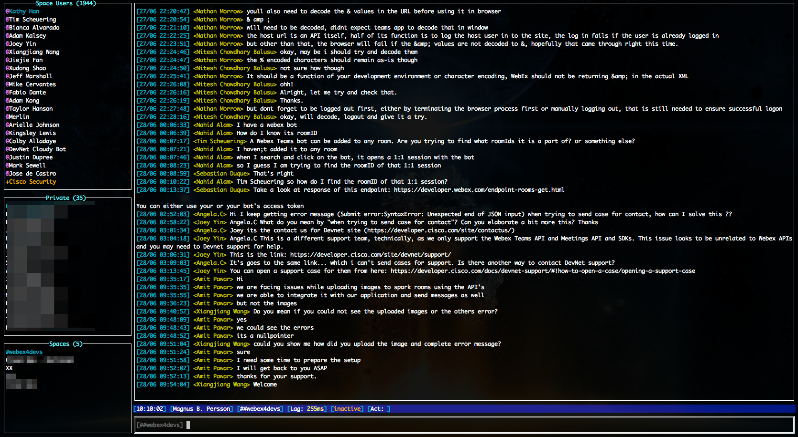

# SPINC - Spark In Console
This is a Cisco Spark (now called WebEx) chat client for use in console. Written in GO that works in MacOS and Linux.

This client uses about 15MB RAM compared to the official client that uses 500MB - 1000MB RAM.
However, this client currently only support chats (not file-share, video-chat etc).

## Screenshots

<i>The theme is possible to configure in spinc.theme file.</i>
## Use
If you don't want to build form source. Just download "MacOS/spinc" (Mac) or "Linux/spinc" (Linux).

1. Configure "auth_token" in spinc.conf. This token is retrieved by logging in and get authorization token here: https://developer.webex.com/getting-started.html#authentication
2. ./spinc http://<your_external_ip>
3. Write /help in Spinc to view available commands and keyboard shortcuts.

If you don't have an external IP. Use a tunnel. If you decide to use ngrok there is a start script provided (spinc.sh). Spinc register webhooks to receive updates
hence it needs to open up an external port. In case you are behind a firewall you can use any type of tunnel service (or host your own).

<b>Tunnels</b>:
* https://github.com/mmatczuk/go-http-tunnel
* https://ngrok.com
* https://github.com/fatedier/frp
* https://localhost.run

### Paste in Linux
Linux, Unix (requires 'xclip' or 'xsel' command to be installed) in order to use "Ctrl-V" to paste text into input field.

## Configuration
- It's possible to configure which port to use for webhook callbacks. Default is 2601.
- Keyboard shortcuts are possible to configure in spinc.sh
- List of available keys: https://github.com/gdamore/tcell/blob/master/key.go

## Themes
- Default theme is a irssi look. Themes are read from "spinc.theme" file.
- Theme file is configured in spinc.conf
- Available colors: https://github.com/gdamore/tcell/blob/master/color.go (and pretty much all hexadecimal colors)

## Todo
- Logging to file
- Handle memberships update events
- Handle lock/unlock room events (room update event)

## License
MIT

